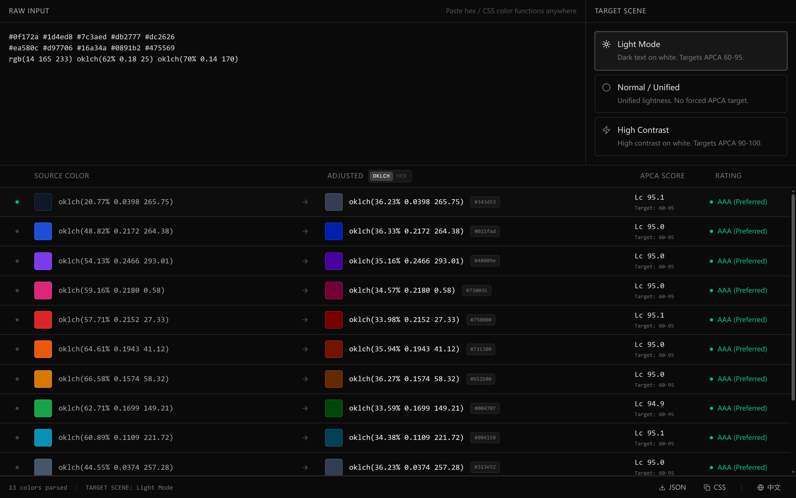

# LumHarmony

[中文](README.zh-CN.md)

An intelligent color harmonization tool. LumHarmony adjusts color lightness with APCA and OKLCh so palettes stay readable and visually consistent across light, normal, and high-contrast scenes.



## Features

- APCA contrast scoring
- OKLCh lightness adjustment
- Light / normal / high-contrast scenes
- English and Chinese UI
- JSON / CSS variable export
- SvelteKit SPA for static deployment

## Tech stack

- SvelteKit 2 + Svelte 5
- Vite+ / Vite 8 / Rolldown
- Tailwind CSS 4
- Bits UI
- Culori + APCA-W3

## Development

```bash
bun install
bun run dev
```

## Check and build

```bash
bun run check
bun run build
bun run preview
```
