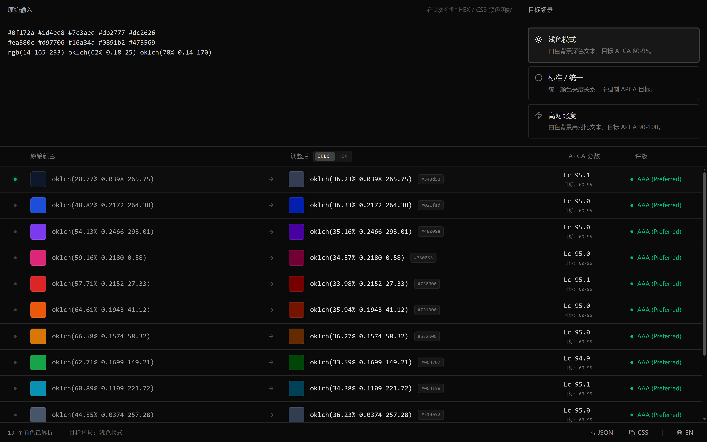

# LumHarmony

[English](README.md)

智能颜色和谐化工具。基于 APCA 与 OKLCh 调整颜色亮度，帮助颜色在浅色、普通、高对比场景下保持可读性和视觉一致性。



## 特性

- APCA 对比度评分
- OKLCh 亮度调整
- 浅色 / 标准 / 高对比场景
- 中英文界面
- JSON / CSS 变量导出
- SvelteKit SPA，静态部署

## 技术栈

- SvelteKit 2 + Svelte 5
- Vite+ / Vite 8 / Rolldown
- Tailwind CSS 4
- Bits UI
- Culori + APCA-W3

## 开发

```bash
bun install
bun run dev
```

## 检查与构建

```bash
bun run check
bun run build
bun run preview
```
